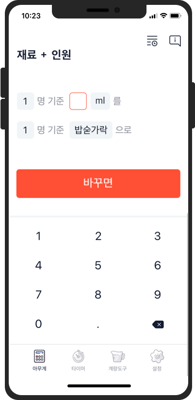

# Portfolio-Dev.Suhyun

## 임수현  

#### Mobile App Developer 

**1998.02.17**  
email - k1miso012@gmail.com  
github - http://github.com/tngusmiso  
blog - https://blog.naver.com/tngusmiso  
blog2 - https://tngusmiso.tistory.com/

> 꼼꼼한 개발자

> 빈 틈을 채워나가는 개발자

> 사람들이 필요로 하는 것이 무엇인지 고민하는 개발자

# **목차**
1. [활동 요약](#활동-요약)  
  1-1. [교육/캠프] Boostcamp 2020 챌린지  
  1-2. [동아리] Nexters   
  1-3. [동아리] S.OWL  
  1-4. [교육/캠프] Naver Campus Hackday  
  1-5. [교육/캠프] 카카오와 함께하는 제주 코딩 베이스캠프  
  1-6. [경진대회] 교내 IT 미디어 컨텐츠 경진대회  
  1-7. [해커톤] 2019 AngelHack Seoul  
  1-8. [해커톤] IF 해커톤  
2. [프로젝트 요약](#프로젝트-요약)  
  2-1. [2020](#2020)  
  2-2. [2019](#2019)  
  2-3. [2018](#2018)  
  2-4. [2017](#2017)  
3. [프로젝트 상세](#프로젝트-상세)  
  3-1. [iOS] [옛다](#ios-옛다)  
  3-2. [iOS] [아무계](#ios-아무계)  
  3-3. [iOS] [Life.M](#ios-lifem)  
  3-4. [Android, iOS, Server] [Pro-Miss](#android-ios-server-pro-miss)  
  3-5. [iOS] [차랑](#android-ios-차랑)  
  3-6. [Web Front-end] [카카오주차장](#web-front-end-카카오주차장)  
  3-7. [Android] [급행열차](#android-급행열차)  
  3-8. [Android, Server] [DUCKS](#android-server-ducks)  
  3-9. [기획] [홀가분](#기획-홀가분)  
  3-10. [RN] [성공회대학교 사회복지연구소 설문조사 앱](#react-native-성공회대학교-사회복지연구소-설문조사-앱)  
  3-11. [Android] [지진대피소 앱](#android-지진대피소-앱)  
  3-12. [Android] [어때?](#android-어때)  
  
   
# **활동 요약**
| 기간 | 프로젝트 명 | 내용     |
|:----|:---------|:--------|
| 2020.07.27 – 2020.08.21 | Boostcamp 2020 챌린지 | 네이버 커넥트재단에서 진행하는 교육 사업으로, 매일 제한된 시간 안에 미션을 해결하고, 동료들과의 피드백을 통해 반복적으로 문제 해결 방법을 반복적으로 학습하는 활동 https://boostcamp.connect.or.kr/|
| 2019.12. - 2020.02. |  Nexters 16th | 개발자와 디자이너의 IT 연합동아리 Nexters에서 개발자로 활동   대학생 기준 방학기간 2달동안 하나의 프로젝트 완수를 목표로 함.   **활동 프로젝트** : [옛다](#ios-옛다)   http://teamnexters.com/ |
| 2019.11.21 - 2019.11.22 |  Naver Campus Hackday 2019 Winter | 대학생들을 대상으로 1박2일 동안 멘토와 함께하는 해커톤 참가   **참가 주제**: Vstagram -> Wtube (이름 변경) // 리스트형 플레이어   https://d2.naver.com/news/5009947 |
| 2019.10.21. | 교내 제 10회 IT&미디어컨텐츠 경진대회 | 성공회대학교 `IT융합자율학부`와 `미디어컨텐츠융합자율학부` 학생들의 정보기술 활용 능력 향상을 목표로 하는 경진대회   **참가 주제** :[Pro-Miss](#android-ios-server-pro-miss)   - 동상 수상 |
| 2019.07. - 2019.08. |  Nexters 15th | 개발자와 디자이너의 IT 연합동아리 Nexters에서 15기 개발자로 활동   대학생 기준 방학기간 2달동안 하나의 프로젝트 완수를 목표로 함.   **활동 프로젝트** : [아무계](#ios-아무계)   http://teamnexters.com/ |
| 2019.06.01 - 2019.06.02 | 2019 AngelHack Seoul | 전 세계의 창업팀이 실리콘벨리로 진출할 수 있도록 지원하는 해커톤 참가   **참가 주제** : [Life.M](#ios-lifem)   https://www.facebook.com/AH2019SEOUL |
| 2019.05.16 - 2019.05.17 |  Naver Campus Hackday 2019 Summer | 대학생들을 대상으로 1박2일 동안 멘토와 함께하는 해커톤 참가   **참가 주제**: iOS 댓글화면 모듈화   https://d2.naver.com/news/5009947 |
| 2019.01.21 - 2019.01.25 | 카카오와 함께하는 제주 코딩 베이스캠프 | 홈페이지 기획부터 Web 개발의 전반적인 내용을 교육하는 행사 수료   기획, Front-end, Back-end 교육 이수 후 해커톤 참가   **참가 주제** : [카카오 주차장](#web-front-end-카카오주차장)   - 2위 수상   http://www.jejucodingcamp.com/ |
| 2018.11.03 - 2018.11.04 | if 해커톤 | IT 기술로 사회문제 해결을 돕는 사회혁신 해커톤 참가    **참가 주제** : [급행열차](#android-급행열차)   - 후원사 특별상 수상   https://www.facebook.com/goifproject/posts/341495643077170/ |
| 2018.03 - 진행중 |  교내 IT 창업 동아리 S.OWL | 교내 IT 동아리에서 회원으로 활동   매월 세미나 개최 및 자체적으로 학생들끼리 강의 및 스터디 진행   https://www.facebook.com/goifproject/posts/341495643077170/|

   

# **프로젝트 요약**

## 2020
| 기간 | 프로젝트 명 | 내용     |
|:----|:---------|:--------|
| 2020.01. - 진행중 | **[옛다](#ios-옛다)**    *Nexters 16th* | 간단한 질문으로 선물 받을 사람의 성향을 분석하여 생일 선물을 추천해주는 앱   **PART** : iOS App (기여도 50%)   **LIST** : UI 커스텀(버튼, 금액 제한 멀티 슬라이더, 질문지 카드뷰 등), 일러스트와 Lottie 모션    **STACK** : `Swift`, `CocoaPods`, `Realm`, `Lottie` |

## 2019
| 기간 | 프로젝트 명 | 내용     |
|:----|:---------|:--------|
| 2019.07. - 진행중 | **[아무계](#ios-아무계)**    *Nexters 15th* | 요리할 때 주변에서 쉽게 구할 수 있는 도구로 계량을 도와주는 앱   **PART** : iOS App (기여도 50%)   **LIST** : 계산기 화면 인터렉션 구현 / 커스텀 Input 버튼 구현 / 타이머 기능 구현(시간 종료 시 Notification, 남은 시간 인터렉션)   **STACK** : `Swift`, `CocoaPods`, `Realm` |
| 2019.06.01 - 2019.06.02 | **[Life.M](#ios-lifem)**   *Angel Hack Seoul* | 인근의 **생리대 자판기**의 위치와 **소녀돌봄약국**, **보건소** 등의 정보를 확인할 수 있는 건강 정보 지도 앱   **PART** : iOS App (기여도 50%)   **LIST** : 현재 위치 표시 기능 구현 / 마커 클릭 시 지도 이동 인터렉션과 상세정보 화면 구현 / 교육지원 프로그램 상세 정보 화면 구현   **STACK** : `Swift`, `CocoaPods` |
| 2019.03. - 2019.10.21. | **[Pro-Miss](#android-ios-server-pro-miss)**   *캡스톤 디자인 수업*   *교내 IT 경진대회* | 약속에 지각하면 벌금을 부과하여 약속을 지킬 수 있도록 도와주는 앱   - 교내 IT 경진대회 동상 수상   **PART** : Android App (기여도 40%), iOS App (기여도 70%), 서버 (기여도 10%)   **LIST** : 회원가입, 로그인 기능 / 지도 기능 / 남은 시간과 원이 줄어드는 간격 계산식 구현 / 약속 만들기 기능 / 지난 약속 목록 구현   **STACK** : `Java`, `Swift`, `CocoaPods`, `Php`, `Laravel` |
| 2019.01. - 2019.06. | **[차랑](#android-ios-차랑)**   *외주* | 교통사고 발생 시 위치 기반으로 편리하게 실시간 사고 접수를 할 수 있는 앱  **PART** : Android App Demo (기여도 30%), iOS App Beta (기여도 50%)   **LIST** : 실시간 위치 표시 기능 / 전화 및 문자 접수 기능 / 상세 주소 검색 기능 / 좌표 주소 변환 기능 / 회원 정보 수정 기능   **STACK** : `Java`, `Swift`, `CocoaPods`|
| 2019.01.24 - 2019.01.25 | **[카카오주차장](#web-front-end-카카오주차장)**   *제주 코딩 베이스캠프 해커톤* | 개인 주차 공간을 공유할 수 있는 웹서비스 기반 플랫폼   (제주도의 주차공간 문제 해결을 위해 개발)   - 2위 수상   **PART** : Web-Front (기여도 50%)   **LIST** : (대여자) 대여 신청 페이지 / (판매자) 주차장 등록 페이지    **STACK** : `HTML5`, `CSS3`, `JavaScript` |

 

## 2018
| 기간 | 프로젝트 명 | 내용     |
|:----|:---------|:--------|
| 2018.11.03 - 2018.11.04 | **[급행열차](#android-급행열차)**    *if 해커톤* | 저소득층 아동 청소년을 위한 급식카드 활성화를 위하여 인근의 가맹점 정보를 제공하고, 홍보를 돕는 앱   - 후원사 특별상 수상   **PART** : Android App (기여도 50%)   **LIST** : 카테고리 별 가맹점 목록 / 가맹점 목록을 지도에 표시 / 급식카드 종류 목록   **STACK** : `Java`|
| 2018.11. - 2018.12. | **[DUCKS](#android-server-ducks)**   *Java 프로젝트 수업* | 덕후들을 위한 취향 공유 앱   (자신의 관심사에 대한 일정과 사진 등을 공유하고 2차 생산물 등을 판매 및 나눔할 수 있는 앱)   **PART** : (개인 진행) Android App, API Server   **LIST** : DB구조 설계 / 회원가입, 로그인 / 관심사 설정 기능 / 관심사 상세 정보(카테고리, 대표 사진, 팔로워 수 등) / 일정 추가 및 가져오기 기능 / 게시판 글 작성 및 수정 기능 / 댓글 기능 /    **STACK** : `Java`, `Php`, `MySQL`|
| 2018.06. - 2018.07. | **[홀가분](#기획-홀가분)**   *전주시 공공데이터 앱 공모전*| 텃밭 분양 정보를 제공하며, 농장 일지를 기록하여 공유할 수 있는 SNS 형태의 앱   **PART** : 기획   **LIST** : 아이디어 제안 및 구체화 / 카카오오븐 툴을 사용하여 프로토타입 제작 / 사용할 라이브러리 스펙 정의 |
| 2018.03. - 2018.06. | **[성공회대학교 사회복지연구소 설문조사 앱](#react-native-성공회대학교-사회복지연구소-설문조사-앱)**   *외주* | 성공회대학교 사회복지연구소에서 연구목적으로 사용하기 위한 설문조사 앱   **PART** : Hybird App (기여도 35%)   **LIST** : yaml 설문지 파일 제작 / yaml 파일화면 처리 / 문항 점프 로직 / 답변 별 가중치 점수 부여 로직   **STACK** : `React-Native`|

 

## 2017
| 기간 | 프로젝트 명 | 내용     |
|:----|:---------|:--------|
| 2017.12. - 2018.02. | **[지진대피소 앱](#android-지진대피소-앱)** | 공공데이터 Open API를 활용하여 인근의 지진대피소 정보를 제공해 주는 앱   **PART** : Android App (기여도 50%)   **LIST** : 메인화면 UI 구현 / 지진대피소 상세정보 페이지   **STACK** : `Java`|
| 2017.12. - 2018.02. | **[어때?](#android-어때)** | Microsoft의 Emotion API를 활용하여 현재 사용자의 표정에 어울리는 음악을 추천해 주는 앱  **PART** : Android App (기여도 60%)   **LIST** : 카메라 전환 / 촬영한 사진을 Emotion API에 적용하여 감정 분석   **STACK** : [`Thunkable`](https://thunkable.com/#/) (Drag & Drop 방식의 블록코딩)|

   

# **프로젝트 상세**
## [iOS] 옛다  

> 간단한 질문으로 선물 받을 사람의 성향을 분석하여 생일 선물을 추천해주는 앱
- iOS Source : https://github.com/Nexters/Yetda_iOS  
Android Download : https://play.google.com/store/apps/details?id=com.nexters.yetda.android  
iOS Download : 배포 예정  

- Nexters에서 활동하며 진행한 2번째 프로젝트입니다. 지인의 생일 선물을 준비할 때 어떤 선물을 골라야 할 지 고민이 됩니다. 생일인 사람에게 직접 받고 싶은 선물을 물어보기보다는 간단한 질문들을 통해 랜덤으로 선물을 추천해 주는 앱으로 그 고민을 해결하고자 하였습니다. 귀여운 일러스트와 모션(Lottie)을 적용하였습니다.

---
## [iOS] 아무계

> 요리할 때 주변에서 쉽게 구할 수 있는 도구로 계량을 도와주는 앱  
- iOS Source : https://github.com/Nexters/Amoogye-iOS  
Android Download : https://play.google.com/store/apps/details?id=cookcook.nexters.com.amoogye  
iOS Download : 배포 예정  

- Nexters에서 활동하게 되면서 진행하게 된 프로젝트입니다. 요즘은 인터넷에 조금만 검색해도 다양한 레시피들이 나오기 때문에 누구나 쉽게 다양한 요리를 해 볼 수 있습니다. 하지만 요리 초보자들에게는 계량도구가 없는 상황에서 레시피의 단위가 정량 수치로 되어있으면 참 당황스럽습니다. 이런 분들을 위해 아무계를 개발하게 되었습니다.

---
## [iOS] Life.M

> 인근의 생리대 자판기의 위치와 소녀돌봄약국, 보건소 등의 정보를 확인할 수 있는 건강 정보 지도 앱  
- iOS Source : https://github.com/angelhack-seoul-2019/SanitaryPadSharingService-iOS  
Video : https://www.youtube.com/watch?v=4GCDzG1kvFU  

- 급하게 생리대가 필요할 때, 생리대 자판기의 위치를 알 수 있으면 좋겠다는 생각에서 시작된 서비스입니다. 여성 복지를 위해 운영되고 있지만 실 사용률이 낮은 생리대 자판기의 접근성을 높이고, 나아가 여성 청소년이 건강한 성인으로 자랄 수 있는 심리적 기반을 형성하는 데에 도움을 주기 위하여 개발하였습니다.

---
## [Android, iOS, Server] Pro-Miss

> [Android, iOS, Server] 약속에 지각하면 벌금을 부과하여 약속을 지킬 수 있도록 도와주는 앱  
- Android Source (구버전) : https://github.com/SKHU-CSE/Pro-Miss  
iOS Source : https://github.com/SKHU-CSE/Promiss_iOS  
Video : https://www.youtube.com/watch?v=bqL3uaNtA2k  

- 약속 시간을 지킬 수 있도록 도와주는 Android, iOS 앱 \<Pro-Miss>를 개발하였습니다. 시간이 지날수록 일정 범위 안에 들어가야 하는 생존게임 <배틀그라운드>를 연상시키는 방식으로 작동됩니다. 약속 시간이 다가올수록 가까워져야 할 거리를 원으로 표시해 주고, 원 밖으로 벗어나거나 지각하게 되면 벌금이 부과됩니다. 게임처럼 즐겁게 사용할 수 있어 참여율을 높힐 수 있고, 지불된 벌금은 기부를 하거나 공금으로 사용하여 더 의미있는 모임 문화를 형성할 수 있을 것입니다.

- SNS 로그인과 위치공유 기능을 구현하였고, 네이버 지도 API를 사용했습니다.

- 교내 IT경진대회에서 동상을 수상하였습니다.

---
## [Android, iOS] 차랑
> 교통사고 발생 시 위치 기반으로 편리하게 실시간 사고 접수를 할 수 있는 앱  
- Android Source : https://gitlab.com/s-owl/charang (private)  
iOS Source : https://gitlab.com/namsoo5/charang-ios (private)  
Android Download : https://play.google.com/store/apps/details?id=charang.sowl.charang_android  
iOS Download : 발주처 사정으로 차후에 배포 예정  

- 담당 분야
    - 지도에 현재 위치를 표시하고 주소 정보를 불러오는 기능 : `Naver Maps API`(v3), `Reverse Geocoding`(v2), `CoreLocation`
    - 전화 및 문자 메세지로 사고를 접수하는 기능 : `UIApplication.shared.open()`, `MFMessageComposeViewControllerDelegate`
    - 상세 주소 검색 기능(사용자가 위치 기반이 아니라 검색을 통해 사고 접수 위치를 지정하고 싶을 때) : `Naver Search Places`, `Geocoding`
    - 회원 정보 수정 기능
    
- 모든 통신은 `Alamofire`로 구현 

---
## [Web Front-end] 카카오주차장
> 개인 주차 공간을 공유할 수 있는 웹서비스 기반 플랫폼 
- Source : https://github.com/tngusmiso/kakaoparking01  

- 제주도는 인구대비 등록차량이 매해 증가하고 있으며, 세계 대비 차량비율이 1.93대로 주차갈등이 심각한 상황입니다. 2019년 7월 1일부터 차고지 증명제가 시행된다는 입법 예고에 따라 주차면 가치까지 상승하고 있습니다. 따라서 주차면 거래가 활성화 될 것이라는 예측에 의하여 주차공간 공유 서비스를 개발하게 되었습니다.

- 저는 웹 프론트를 담당하였으며, 차량을 이용하는 중장년층 세대도 쉽게 접근가능하도록 Bootstrap을 활용하여 디자인을 깔끔하고 간단하게 만드는 것에 초점을 맞추었습니다.

- 결과/성과 : 제주도에서 진행된 해커톤인만큼 제주를 발전시킬 수 있는 서비스를 기획하려고 노력했습니다. 철저한 시장 분석과 실제 도민에게 필요한 요구 분석을 통해 접근한 결과, 해커톤에서 2위를 수상하였습니다.

---
## [Android] 급행열차

> 저소득층 아동 청소년을 위한 급식카드 활성화를 위하여 인근의 가맹점 정보를 제공하고, 홍보를 돕는 앱
- Android Source : https://github.com/SKHU-CSE/if_ExpressTrain  

- 현재 급식 카드가 활발하게 사용되고 있지 않기 때문에 가맹점의 수가 많지 않고, 단말기의 노후로 실제 사용할 수 있는 지점이 적습니다. 결국 아동들은 매번 가맹점을 찾아다니기 보다 편의점에서 식사를 떼우는 것을 선택합니다. 아동급식카드의 취지인 아동청소년들의 고른 영양 섭취를 위해 가맹점들을 카테고리별로 보여주고, 주문 가능한 메뉴가 무엇인지 보여주는 서비스입니다. 단순히 가맹점 목록과 위치를 나열하는 것에서 벗어나, 급식카드 가맹이 되어 있지 않더라도 저렴한 금액과 풍부한 영양의 식당을 소개해 주는 기능까지 더하여 확장성을 도모하였습니다.

- 제가 담당한 분야는 안드로이드였습니다. http통신을 이용해 서버에 저장된 DB의 내용을 불러오고, 리사이클러뷰를 활용하여 그 데이터들의 목록을 화면에 보여주었습니다. 또한 네이버 지도 API를 사용하여 가맹점의 위치를 보여주었습니다.

- 결과/성과 : 사회적 약자를 위한 해커톤이었습니다.이 서비스는 이용 대상이 저소득층 청소년들로 명확하고 그들에게 반드시 필요한 서비스이기 때문에 자연스럽게 사용자들이 유입될 것이라고 생각했습니다. 또한 서비스를 제공하면서 수집되는 데이터를 더 나은 정책 마련의 발판으로 작용할 수 있다는 점에서 높은 점수를 받아 후원사 특별상을 수상하였습니다.
---
## [Android, Server] DUCKS

> 덕후들을 위한 취향 공유 앱  
- Source : https://github.com/tngusmiso/javaPJ-Android-2018  
Video : https://www.youtube.com/watch?v=VleSDcJlUfg  

- 안드로이드 기반의 취향공유 플랫폼을 개발하였습니다. DUCKS는 흔히 말하는 '덕후(일본의 오타쿠, 즉 매니아층을 부르는 말의 변형)'들을 위한 커뮤니티 형태의 어플입니다. 자신이 좋아하는 취향을 선택하고 그 취향에 맞는 일정을 살펴볼 수 있으며, 공유게시판을 통해 물건을 팔거나 나눌 수 있습니다. 선택할 수 있는 취향은 연예인이나 애니메이션, 영화, 스포츠 까지 다양하게 있습니다. 이 어플을 통해 자신이 좋아하는 것을 마음껏 공유하고 서로의 취미 생활을 응원하다보면 더 좋은 문화로 발전할 것을 기대해 보았습니다.

- 개인 프로젝트였기 때문에 안드로이드, 서버, DB까지 모두 혼자서 구현하였습니다. 서버와의 통신은 HttpURLConnection보다 간편한 OkHttp 라이브러리를 사용하여 구현하였고, 서버는 네이버클라우드 플랫폼의 ubuntu 웹서버를 사용하였습니다.  

---
## [기획] 홀가분
> 텃밭 분양 정보를 제공하며, 농장 일지를 기록하여 공유할 수 있는 SNS 형태의 앱
- Source : https://github.com/HolGa-Bun/HolidayGarden  

- 전주시 공공데이터를 활용하여 텃밭 분양 안드로이드 어플리케이션을 만들었습니다. 지역별로 분양중인 텃밭을 살펴볼 수 있고, 농사에 필요한 날씨정보와 농작물 재배 방법에 대한 정보를 제공받을 수 있습니다. 또한 텃밭일지를 작성할 수 있는 SNS기능도 포함되어 있어 귀농을 희망하거나 취미로 텃밭가꾸기를 할 사람들의 커뮤니티를 형성하는데에 도움을 줄 수 있는 어플입니다. 

- 기획과 디자인을 담당하였습니다. 개발 능력도 중요하지만 서비스를 처음부터 기획해보는 과정도 필요하다는 생각이 들었기 때문입니다. 어떤 기능이 구현되어야 하고 어떤 사용자 요구사항이 있을지를 파악하고 나니 무엇을 공부해야 할지도 명확해졌습니다. SNS를 만들기 위해서는 기본적으로 회원 가입을 통해 회원 정보를 관리해야 하고, 팔로우 시스템을 도입할 것인지 친구 신청을 통해 서로 친구를 맺을 수 있도록 할 것인지도 고민해야 했습니다. 타임라인에는 어떠한 내용의 게시물들이 보여져야 하며 댓글과 좋아요 및 공유하기 기능의 권한을 어느 정도로 설정할 것인지 정하는 과정도 필요했습니다. 단순히 SNS를 사용자 입장에서만 바라보았다가 직접 만들어야 할 기능을 세분화 해보니 앞으로 프로젝트를 할 때 어떤 방향으로 진행이 될 지 큰 흐름을 잡는데에 도움이 되었습니다.

---
## [React Native] 성공회대학교 사회복지연구소 설문조사 앱
> 성공회대학교 사회복지연구소에서 복지사들이 연구목적으로 사용하기 위한 설문조사 앱
- Source : https://gitlab.com/s-owl/surveyapp (private)  
Android Download : https://play.google.com/store/apps/details?id=kr.ac.skhu.sowelab.surveyapp  
iOS Download : https://apps.apple.com/kr/app/성공회대학교-사회복지연구소-설문조사앱/id1404763167  

- 교내 IT 창업 동아리 S.OWL에서 활동중입니다. 성공회대학교 사회복지연구소의 의뢰로 설문조사 어플리케이션 개발을 맡게 되었습니다. 발주처에서는 사회복지사들이 돌봄 어르신들을 대상으로 진행하는 여러 종류의 설문조사에서 매번 결과값을 수동으로 합산하고 처리하는 방식에 불편함을 느껴 앱 제작을 고려하게 되었다고 합니다. Android와 iOS 모두에서 구동되는 앱을 개발해야 했기 때문에, 쉽게 익힐 수 있는 javascript를 사용하여 하이브리드처럼 작동할 수 있는 ReactNative를 개발 언어로 선택했습니다.

- 설문지 파일을 yaml 형식으로 구조화하고 화면에서 처리하는 부분을 담당했습니다. json 형식의 데이터는 여러번 다루어 보았지만, 비개발자인 복지사분들도 설문지 문항을 제작하기 편리하도록 json 대신 yaml 형식을 선택했습니다. 문항 유형별로 화면에 보여지는 방법이 달라져야 하기 때문에 먼저 유형을 단일 응답과 다중응답, 주관식 등으로 세분화하였습니다. 일부 문항은 응답별 가중치를 부여하여 문항을 점프하거나 점수를 합산해야 하는데, 이 부분의 로직 처리에 문제가 생겨 다시 문항 유형을 더욱 세분화 하였습니다. 응답을 마친 후 계산된 결과는 엑셀 파일에 자동으로 저장되도록 구현했습니다.

---
## [Android] 지진대피소 앱
> 공공데이터 Open API를 활용하여 인근의 지진대피소 정보를 제공해 주는 앱
- 규모 5.2의 포항 지진이 발생한 이후 수능이 미뤄진 사건이 있었습니다. 더이상 한국도 지진에 대해 안전한 국가가 아니라는 생각에, 지진대피소 정보를 제공하는 앱을 개발하였습니다. 정부에서 제공하는 공공데이터 Open API를 활용하였으며, Google Map API를 사용해 지진대피소 위치를 표시하였습니다.

---
## [Android] 어때? 
> Microsoft의 Emotion API를 활용하여 현재 사용자의 표정에 어울리는 음악을 추천해 주는 앱
- 프로그래밍 언어에 익숙하지 않아서 Drag & Drop 방식의 블록코딩으로 Android 앱을 제작하였습니다. MS의 Emotion API를 활용하면 재밌는 서비스를 만들 수 있을 것 같다는 생각에, Emotion API를 연동해서 개발할 수 있는 블록코딩 사이트를 찾아보았고, Thunkable이라는 웹 애플리케이션을 사용하게 되었습니다. 음악 스트리밍기능까지 제공하고 싶었지만, 저작권 문제 등 복합적인 어려움이 있어서 유튜브 링크로 연동하는 것으로 마무리하였습니다. 감정은 크게 기쁨, 슬픔, 분노, 놀람 4가지로 구분하였고, 각 감정에 맞는 음악은 저의 주관에 따라 유튜브에 재생목록을 만들어 링크를 걸어두었습니다. 지능적인 추천 시스템은 아니었지만, 상상한 앱을 직접 실현시켜보는 좋은 경험이 되었습니다.
